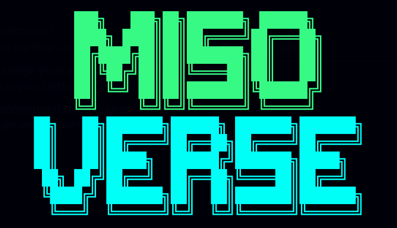
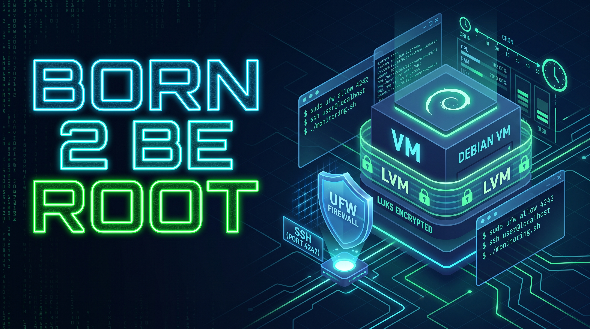
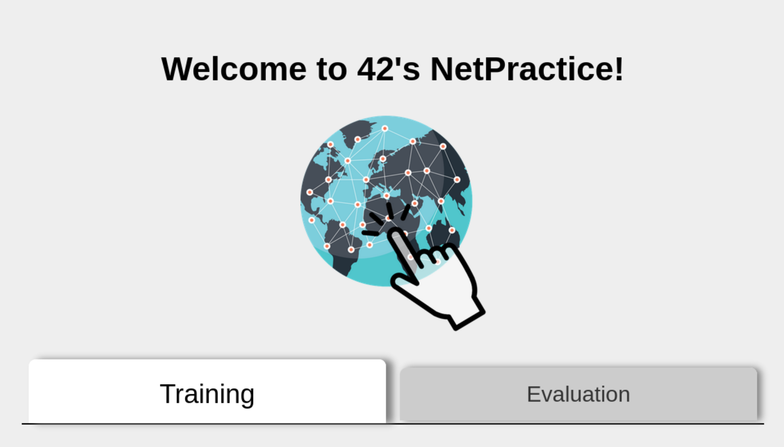
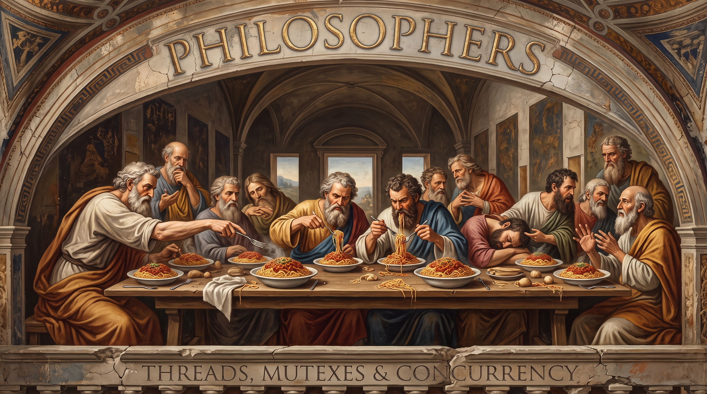
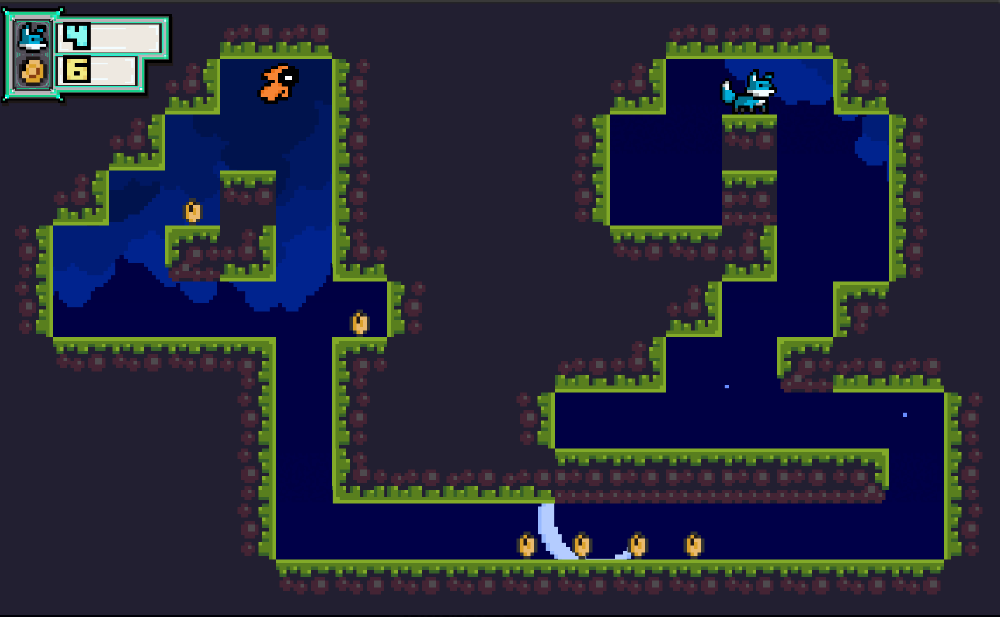
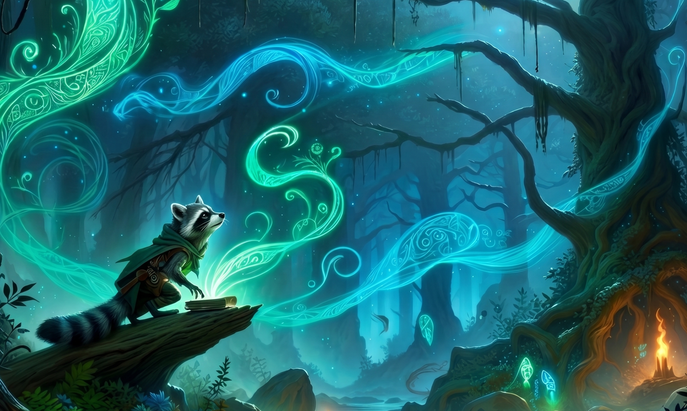

  

<h1 align="center">Hi 👋, I'm Luis "Mapache" Torcate </h1>
<h3 align="center">I'm a creative Software Developer currently studying at 42 Porto. Known by my peers as "un tipo que resuelve" (a guy who figures it out), I thrive at the intersection of creative problem-solving, operational efficiency, and low-level programming.</h3>

- 🔭 I’m currently working on **core curriculum projects at 42 Porto (like Minishell!)**

- 🌱 I’m currently learning **C, C++, Python, and Systems Architecture**

- 📫 How to reach me: **ljtorcate@gmail.com**

- 📄 Know more about my background on my [**LinkedIn**](https://linkedin.com/in/luis-mapache-torcate)

- ⚡ Fun fact: **Before diving into IT and low-level programming, I studied Audiovisual Arts. I firmly believe that coding and software development are just the ultimate tools for storytelling and immersion!**

 

<h3 align="left">🚀 Featured Projects:</h3>

If you want to see what I have been building, here is a quick breakdown of my top projects:

| Banner | 📖 Project Description | 🛠️ Tech Stack |
| :--- | :--- | :--- |
|  | **[Misoverse](https://github.com/jennamustajarvi/minishell.42)** is a custom shell program recreating UNIX bash functionality, handling complex command-line parsing, memory management, tokenization, and piping. | `C`, `Bash`, `Signals`, `Make`, `Shell`, `I/O Routing`, `Processes`, `Memory Management`, `Environ` |
|  | **Born2beroot** is a secure, minimalistic virtual server built with strict encrypted LVM partitions, UFW firewalls, and SSH port configurations. | `Debian`, `LVM`, `Bash`, `Cron`, `UFW`, `FTP`, `SSH`, `Sudo`, `systemd`, `Daemon`, `Services`|
|  | **[NetPractice](https://github.com/Raccoonatic/NetPractice)** is a practical project about network administration involving hands-on CIDR subnet masking, routing tables, and IP configurations under pressure. | `TCP/IP Config`, `Routing`, `CRM`, `MIMEs`, `OSI Layers`, `Subnets`, `IPV4` |
|  | **[Philosophers](https://github.com/Raccoonatic/Philosophers/)** is a custom shell program recreating UNIX bash functionality, handling complex command-line parsing, memory management, tokenization, and piping. | `C`, `Multi-threading`, `Data Races`, `Mutexes`, `Synchronization`, `Concurrency`, `Memory Management` |
|  | **[Glutto the Fox](https://github.com/Raccoonatic/Glutto-The-Fox/)** is my interpretation of 42's ***So_long*** project. In short a 2D game developed entirely in C using the MiniLibX (mlx) graphics library. | `C`, `mlx`, `Graphic Rendering`, `Pixel Addressing`, `Game Loops`, `.xpm`, `Visual Lerping`, `AABB Collision`, `Event Handling`, `Memory Management` |
|  | **[The Verdant Veil](https://github.com/Raccoonatic/Cub3D/)** is my team's interpretation of 42's ***Cub3D*** project. That explores the mathematical foundations of early 3D gaming to create a first-person raycasting engine completely in C.  | `C`, `mlx`, `Graphic Rendering`, `Pixel Addressing`, `Game Loops`, `.xpm`, `Event Handling`, `Raycasting`, `DDA`, `Camera Planes`, `Bresenham's Algorithm`, `1D Affine Texture Mapping`, `Memory Management`|

*(Note: Click the project names to check out the repositories!)*
 

<h3 align="left">Languages and Tools:</h3>

&nbsp;&nbsp;&nbsp;
&nbsp;&nbsp;&nbsp;
&nbsp;&nbsp;&nbsp;
&nbsp;&nbsp;&nbsp;
&nbsp;&nbsp;&nbsp;
&nbsp;&nbsp;&nbsp;
&nbsp;&nbsp;&nbsp;

<h2> </h2>
<h3 align="center">Connect with me:</h3>

&nbsp;&nbsp;
&nbsp;&nbsp;
&nbsp;&nbsp;
&nbsp;&nbsp;
&nbsp;&nbsp;
 

